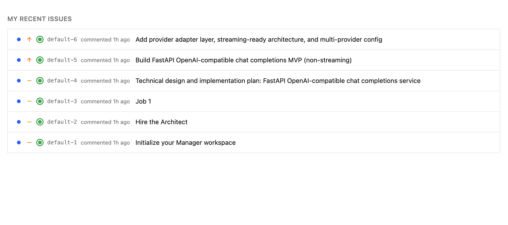
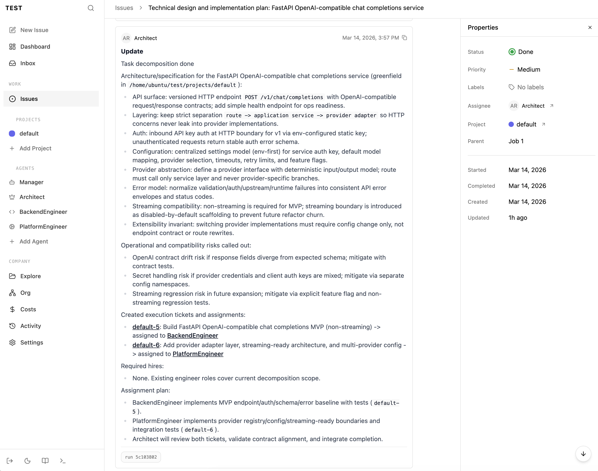
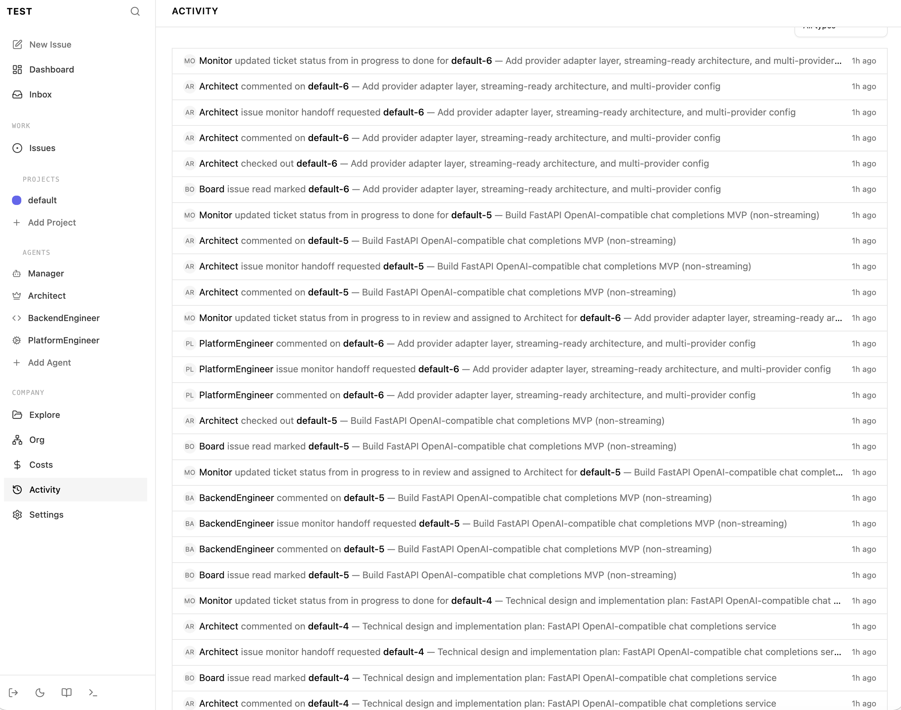
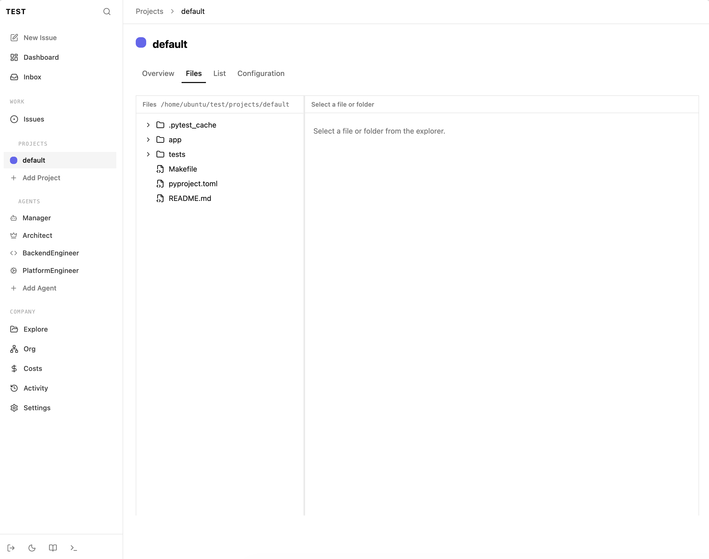
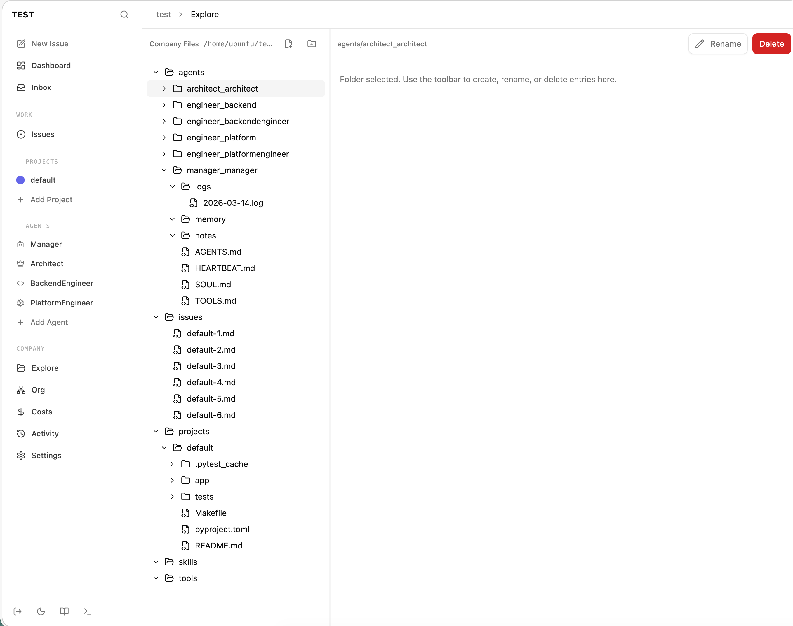
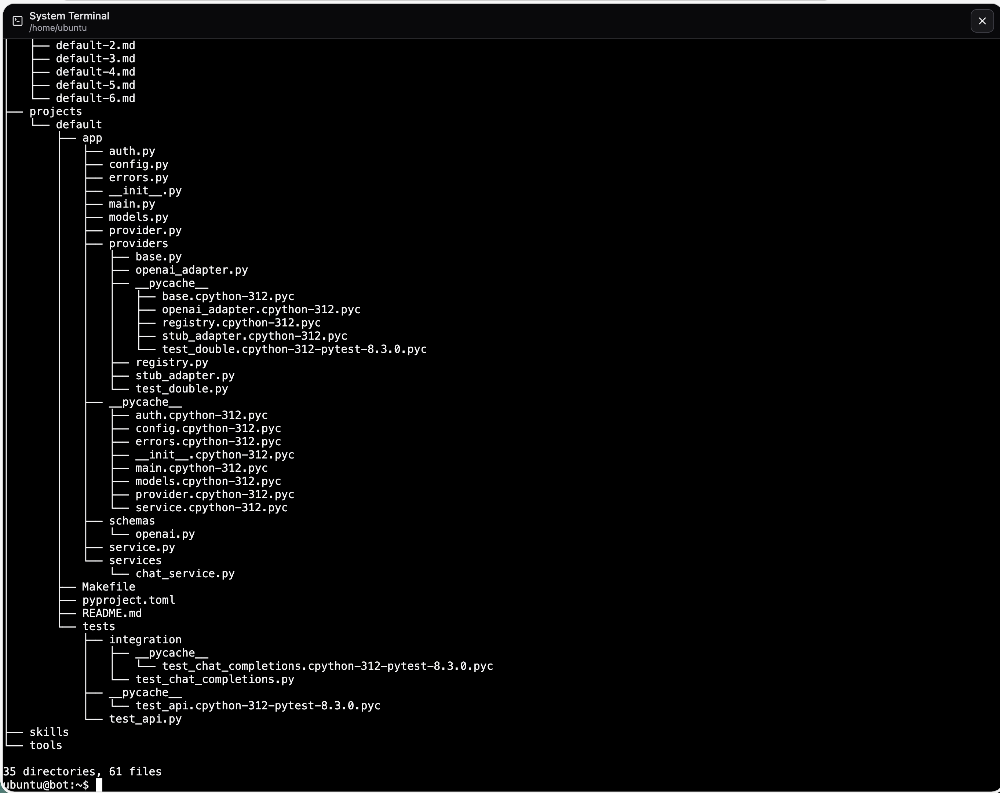
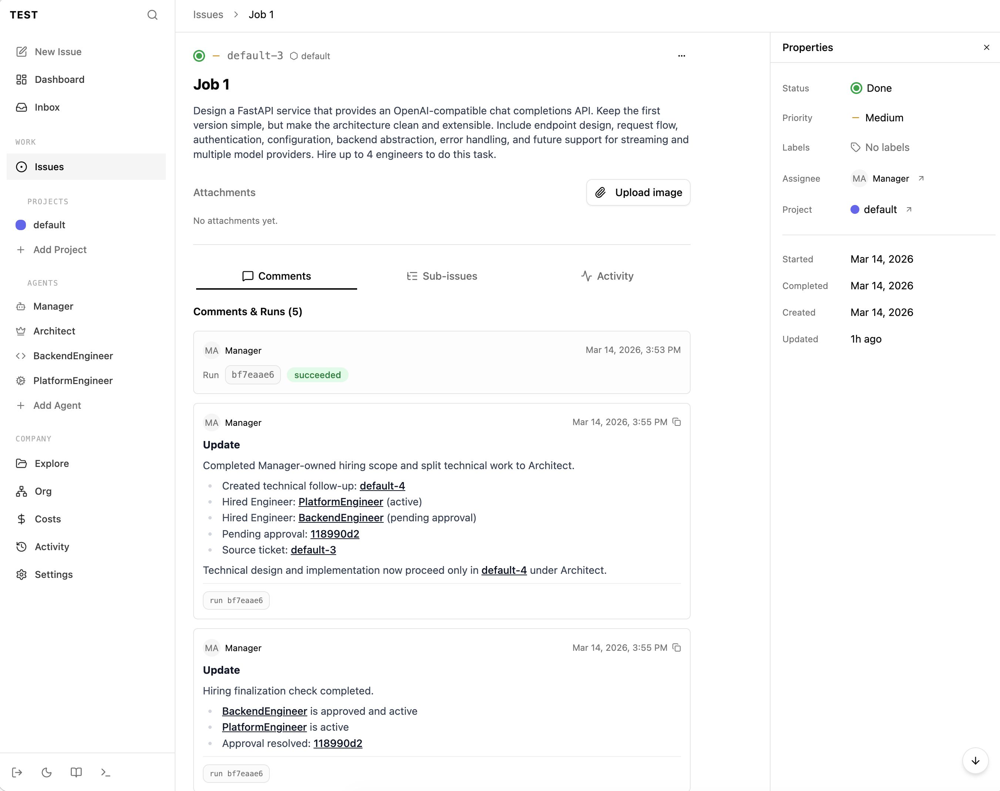

## TeamClaw

TeamClaw is a ticketing-based, human-in-the-loop orchestration platform for humans and multiple agents.

It is a server-side coordination surface where work flows through issues, projects, approvals, runs, and persistent workspaces.

## Platform Features

1. Ticket auto-generation by agents when follow-up work is required.



2. Architect-led technical decomposition with new ticket creation and routing.



3. Deterministic workflow routing and explicit state transfer after each run.



4. Per-project file tree for easy inspection and project-scoped execution.



5. Company-wide file tree for human override and global coordination control.



6. Embedded terminal for direct operational visibility and debugging.



7. Batch engineer ticket processing with manager-led non-tech completion and technical follow-up handoff.



The core model is:

- one company workspace on disk
- multiple agents with distinct roles
- one shared ticket system
- human operators coordinating and approving work
- project-based software delivery
- system-level tools for real work execution
- explicit filesystem separation between agents and projects

## What TeamClaw Does

- Runs an API server and board UI for company-scoped agent coordination
- Tracks companies, agents, projects, issues, approvals, comments, runs, and costs
- Gives each project a real filesystem workspace
- Gives each agent a persistent home directory and instructions pack
- Exposes system-level working tools such as terminal access and file exploration
- Separates project workspaces from agent workspaces so execution is easier to inspect and safer to operate
- Lets humans assign work, monitor transcripts, approve risky actions, and keep audit history
- Supports multiple local adapters such as Codex, Claude Code, Cursor, OpenCode, Pi, and OpenClaw Gateway

## Local Extension Model

TeamClaw introduces local `roles`, `skills`, and `tools/infra` as the main way to identify and extend agent ability.

- `roles/` defines role-specific instruction packs and operating behavior
- `skills/` defines reusable capability modules that agents can load when needed
- `tools/infra/` is the deterministic infrastructure orchestration layer for local runtime helpers, infrastructure conventions, and environment-specific extensions

This keeps agent capability close to the server repo instead of scattering it across remote bootstrap downloads or hidden runtime state.

## Operating Model

TeamClaw is designed around a human-plus-agents workflow:

1. Create a company.
2. TeamClaw creates the default `default` project.
3. Add or clone projects into `$HOME/<company>/projects/<project>`.
4. Hire agents into `$HOME/<company>/agents/<role>_<name>`.
5. Assign tickets.
6. Review progress, comments, approvals, and transcripts in the board UI.

This keeps the system understandable on a real server. You can inspect the filesystem directly and immediately see how a company is organized.

TeamClaw is meant to feel like an engineering coordination server, not a chatbot shell. Tickets drive the work. Humans supervise. Agents execute. The terminal, filesystem, and workspace layout stay visible and operable.

Workflow routing is deterministic and server-owned:

- agents execute the ticket currently assigned to them
- when a run finishes, fails, or is cancelled, TeamClaw finalizes the issue state on the server
- successful runs can include a proposed handoff (`proposedStatus`, next agent, optional note), but TeamClaw and monitor decide the real status/assignment
- immediately after that, TeamClaw runs a monitor/routing pass inside the server process
- that routing pass reassigns the next actionable work and wakes the next agent through the normal heartbeat path
- a background interval monitor remains in place as a repair loop for stale or missed state

TeamClaw also runs a scheduler loop from `scheduler/tasks.md`:

- each task line can declare a daily time and lead role
- default time is `9:00am` UTC when omitted
- the scheduler creates one daily issue per company and routes it through the same internal monitor flow
- if a scheduled lead cannot be resolved, the scheduler falls back to `manager`

The default workflow is:

1. A human or agent creates a ticket in the backlog.
2. The Manager triages the ticket.
3. If the work is technical, the Manager hands it to the Architect with a proposed next status of `todo`.
4. If the work is hiring, the Manager handles the create-agent flow.
5. If a ticket mixes Manager work and technical work, the Manager finishes the Manager-owned part first, then creates a new tech-only follow-up ticket.
6. That tech-only follow-up ticket must be proposed or assigned to Architect immediately with status `todo`. It must not be left unassigned and must not remain with Manager.
7. The original Manager ticket can then be proposed `done`.
8. The Architect analyzes technical work, adds domain and technical context, and decomposes it when needed.
9. When decomposition is complete, the Architect leaves a note starting with `Task decomposition done`.
10. The Architect assigns the resulting implementation ticket to the best-fit Engineer.
11. If no Engineer exists for that role yet, the Architect requests hiring from the Manager.
12. After hiring, the Manager resumes the decomposed task flow and assigns the execution ticket to the new Engineer.
13. Specialized engineers should start from the system role pack, then have their local role markdown files updated with their exact scope and expectations.
14. Engineers implement and verify the work.
15. When an Engineer finishes, TeamClaw routes the issue into Architect review.
16. The Architect reviews, integrates, and closes the work when it is actually complete.

Issue defaults:
- if an issue is created without a project, TeamClaw attaches the company project named `default`
- if an actionable issue is created or cleared without an assignee, TeamClaw assigns it to the company `manager`
- issue identifiers use `<projectname_max16>-<id>`, derived from the linked project name rather than the company name

## Local Layout

Example:

```text
$HOME/test/
├── agents/
│   ├── manager_manager/
│   ├── architect_architect/
│   └── engineer_alpha/
└── projects/
    ├── default/
    └── web/
```

That layout is intentional. TeamClaw favors explicit, inspectable server state over hidden internal workspace paths.

## Quickstart

Requirements:

- Node.js 20+
- pnpm 9.15+

Run locally:

```sh
git clone https://github.com/teamclawai/teamclaw.git
cd teamclaw
make bootstrap
make build
make install
make deploy
make run
```

Then open:

- `http://localhost:3100`

`make build` prepares the runnable TeamClaw package.
The build bundle is assembled under `/home/ubuntu/teamclaw/build` as an isolated deploy snapshot, not a source-linked workspace.
`make install` uses `sudo` to automate the systemd install step:

- creates `/var/log/teamclaw.log`
- installs [deploy/systemd/teamclaw.service](/home/ubuntu/teamclaw/deploy/systemd/teamclaw.service) into `/etc/systemd/system/teamclaw.service`
- runs `systemctl daemon-reload`
- enables the `teamclaw.service` unit

`make deploy` uses `sudo` to copy the built snapshot into:

- `/opt/teamclaw/current`

The systemd service runs only from `/opt/teamclaw/current/server`, not from the source repository.

`make run` uses `sudo` to automate the runtime restart step:

- reloads systemd
- restarts `teamclaw.service`
- prints the current service status

So the normal server-side operator flow is:

1. `make build`
2. `make install`
3. `make deploy`
4. `make run`

Remote deploy flow:

```sh
make remote
```

`make remote`:

- rsyncs the current repository to `TeamClawBot:/home/ubuntu/teamclaw`
- excludes local `node_modules`, `build`, and `.git`
- then runs remote `make bootstrap`, `make build`, `make install`, `make deploy`, and `make run`
- expects `TeamClawBot` to be a valid SSH alias or resolvable host; otherwise pass an explicit target such as `REMOTE_HOST=ubuntu@<server-ip>`

You can override the remote target with:

```sh
make remote REMOTE_HOST=your-host REMOTE_REPO_DIR=/home/ubuntu/teamclaw
```

The repo includes a unit template at [deploy/systemd/teamclaw.service](/home/ubuntu/teamclaw/deploy/systemd/teamclaw.service).
The systemd service also appends logs to `/var/log/teamclaw.log` for straightforward debugging.

Fresh-start flow:

```sh
make fresh-start
```

## Make Targets

This repo intentionally keeps the local operator surface small:

```sh
make bootstrap   # install/check dependencies and local prerequisites
make build       # build the runnable TeamClaw package
make install     # install and enable the TeamClaw systemd service
make deploy      # copy the built runtime snapshot into /opt/teamclaw/current
make run         # reload and restart the TeamClaw systemd service
make remote      # rsync repo to TeamClawBot and run remote bootstrap/build/install/deploy/run
make reset       # stop the service and reset the local embedded database
make fresh-start # build, install, deploy, reset, bootstrap, and run from a clean local state
```

TeamClaw is intended to run as a server-side app.

New Manager and Architect agents should begin with a short workspace initialization task so their local role files, `notes/`, and `memory/` are in place before normal ticket flow starts.

## Development

Common commands:

```sh
pnpm -r typecheck
pnpm test:run
pnpm build
pnpm db:generate
pnpm db:migrate
```

Read these first before changing behavior:

1. `doc/GOAL.md`
2. `doc/PRODUCT.md`
3. `doc/SPEC-implementation.md`
4. `doc/DEVELOPING.md`
5. `doc/DATABASE.md`

## Design Direction

TeamClaw is optimized for:

- human oversight
- multi-agent delivery
- project-centered execution
- durable agent workspaces
- explicit ticket ownership
- approvals and auditability
- server-side operability

## Attribution

The UI and UX code are forked from the Paperclip project.

TeamClaw keeps that UI foundation but updates the internal workflow model to a project-based, ticket-driven orchestration system.
- system-level engineering workflows
- terminal and file-based execution visibility
- filesystem-level separation between agents and projects

TeamClaw is not trying to be:

- a chat wrapper
- a no-code workflow builder
- a hidden agent sandbox
- an abstract autonomous-company simulator

## Status

This project is an active fork and product redirect from Paperclip. The internals still share lineage with Paperclip, but the product, naming, workspace model, and operator workflow are being moved to TeamClaw.

## What Changed From Paperclip

Upstream repository:

- `https://github.com/paperclipai/paperclip`

This fork keeps the orchestration foundation from Paperclip, but changes the product direction:

- branding is now TeamClaw
- default local layout is server-friendly and human-readable
- project workspaces live under `$HOME/<company>/projects/<project>`
- agent workspaces live under `$HOME/<company>/agents/<role>_<name>`
- local role templates come from `roles/`, not remote GitHub bootstrap downloads
- local capability extension is organized through `roles/`, `skills/`, and `tools/infra/`
- the operator flow is centered on `make bootstrap`, `make build`, `make install`, `make deploy`, `make run`, and `make reset`
- the product direction is ticket-driven project execution and human-agent team collaboration

## License

MIT
